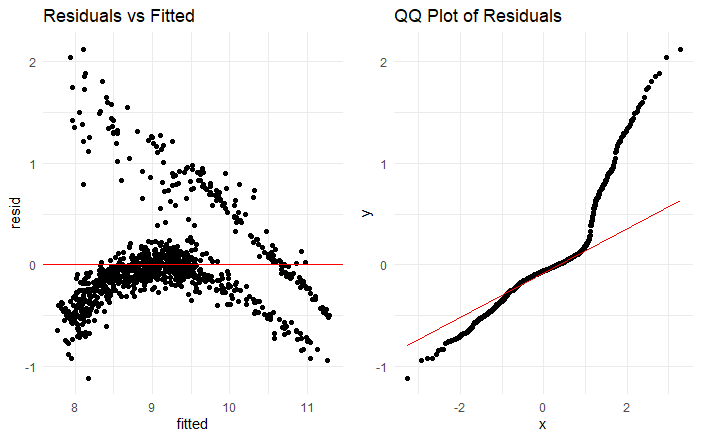
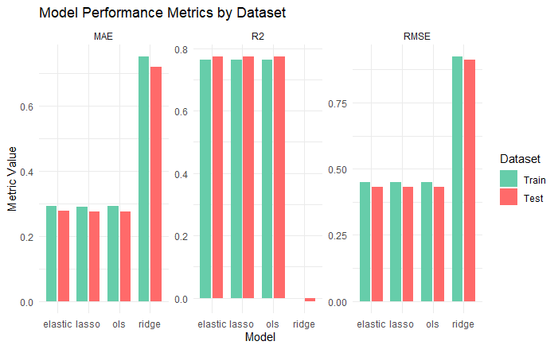

# 🏥 Medical Expenses Prediction

This project predicts **medical expenses** using regression models in **R**.  
We apply **Ordinary Least Squares (OLS)**, **Ridge**, **Lasso**, and **Elastic Net** to evaluate predictive performance and understand the impact of regularization.  

---

## 📑 Table of Contents

1. [Overview](#-medical-expenses-prediction)  
2. [Project Structure](#-project-structure)  
3. [Dataset](#-dataset)  
4. [Methods](#-methods)  
5. [Visualizations](#-visualizations)  
6. [Results](#-results)  
7. [How to Run](#-how-to-run)  
8. [License](#-license)  


---

## 📂 Project Structure
---

## 📊 Dataset

- **File:** `data/insurance.csv`  
- **Rows:** 1,338  
- **Columns:**  
  - `age`: Age of primary beneficiary  
  - `sex`: Gender (male/female)  
  - `bmi`: Body Mass Index  
  - `children`: Number of children covered by health insurance  
  - `smoker`: Whether the person is a smoker  
  - `region`: Residential area (northeast, northwest, southeast, southwest)  
  - `expenses`: Individual medical costs billed by health insurance  

---

## ⚙️ Methods

The following models are applied:

1. **Ordinary Least Squares (OLS)** – baseline regression  
2. **Ridge Regression** – L2 penalty  
3. **Lasso Regression** – L1 penalty  
4. **Elastic Net** – combination of L1 & L2 penalties  

### Steps:
- Data preprocessing (scaling, encoding factors)  
- Train/Test split (70/30)  
- Model fitting (OLS, Ridge, Lasso, Elastic Net)  
- Performance evaluation using **MAE**, **RMSE**, and **R²**  

---

## 📈 Visualizations
### Target Distribution
- Histogram of expenses:
  .png)

- Histogram of log-transformed expenses:
  .png)

### Residual Analysis
- Residuals vs Fitted and QQ plot:
  

### Model Performance
- Comparison of performance metrics (MAE, RMSE, R2) across models:
  

---

## 📊 Results

The table below summarizes the performance of different regression models on the **Medical Expenses dataset**. Metrics were computed on both the training and test datasets.  

| Model    | Dataset | MAE    | RMSE   | R²       | Interpretation                                                                 |
|----------|---------|--------|--------|----------|-------------------------------------------------------------------------------|
| OLS      | Train   | 0.2908 | 0.4487 | 0.7639   | OLS fits the training data well; ~76% of variance in log(expenses) is explained |
| OLS      | Test    | 0.2760 | 0.4316 | 0.7731   | Generalizes well; error is low, and R² is slightly higher than training set    |
| Elastic  | Train   | 0.2912 | 0.4487 | 0.7639   | Similar to OLS; regularization has minimal effect on training set               |
| Elastic  | Test    | 0.2765 | 0.4317 | 0.7730   | Performs similarly to OLS on unseen data                                       |
| Ridge    | Train   | 0.7503 | 0.9234 | 0.0000   | Poor performance; strong regularization over-penalized coefficients           |
| Ridge    | Test    | 0.7200 | 0.9107 | -0.0104  | Fails to generalize; negative R² indicates worse than predicting the mean      |
| Lasso    | Train   | 0.2905 | 0.4488 | 0.7638   | Comparable to OLS; L1 regularization slightly affects coefficients            |
| Lasso    | Test    | 0.2750 | 0.4311 | 0.7736   | Best performance on test set; slightly better generalization than OLS         |

### Metric Explanation

- **MAE (Mean Absolute Error):** Average absolute difference between predicted and actual values. Lower is better.  
- **RMSE (Root Mean Squared Error):** Penalizes larger errors more than MAE; sensitive to outliers. Lower is better.  
- **R² (Coefficient of Determination):** Fraction of variance explained by the model. Closer to 1 is better; negative values indicate very poor fit.

### Insights

1. **OLS, Lasso, and Elastic Net** models perform similarly, with **low errors** and **high R²** (~0.77) on the test set.  
2. **Ridge regression** performed poorly, likely because the selected lambda over-penalized the model, shrinking coefficients too much.  
3. **Lasso slightly outperforms OLS** on the test set, suggesting it may handle multicollinearity or irrelevant features slightly better.  
4. Overall, **linear models are suitable** for predicting transformed medical expenses (log scale), and regularization must be carefully tuned.

---

## ▶️ How to Run

1. Clone the repository:  
   ```bash
   git clone https://github.com/MbofholowoT/Medical-Expenses-Prediction.git
   cd Medical-Expenses-Prediction


